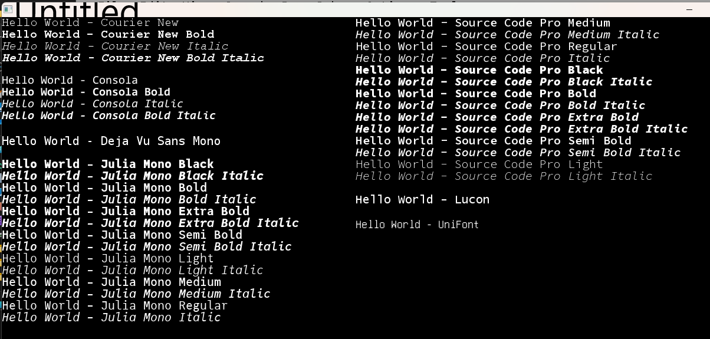

Note that two different precompiler commands are necessary to embed fonts into an user's programs.

First, the precompiler has to know that we're wanting to embed *some* font into our progeam.  To do this, we first have to tell our program that we're going to do so, with either of the two precompiler commands:

```
$LET INCLUDE_ALL = TRUE 
$LET INCLUDE_EMBEDDED_FONTS = TRUE
```

Either of the above will enable Function ReturnFont& and prepare our program for embedding fonts inside it.  The different between the two commands lies in that INCLUDE_ALL *also* enables **ALL** subs and functions inside the toolbox's library.  INCLUDE_EMBEDDED_FONTS *only* adds Function ReturnFont& to a program and prepares it for whichever font we want to embed into it.


Once we've enabled the ability to embed fonts into our program, then we must specify exactly which of the included fonts that we want to embed into our program, with any of the following precompiler commands:

```
$LET EMBED_COURIER_NEW = TRUE
$LET EMBED_CONSOLA = TRUE
$LET EMBED_DEJA_VU_SANS = TRUE
$LET EMBED_JULIA_MONO = TRUE
$LET EMBED_LUCON = TRUE
$LET EMBED_SOURCE_CODE_PRO = TRUE
$LET EMBED_UNIFONT = TRUE
```

Preview of all the fonts which we can make use of, and their various styles:


Note that the various fonts have various styles associated with them, as illustrated above:
```
    COURIER NEW:  (REGULAR, BOLD, ITALIC, BOLD ITALIC)
    CONSOLA:  (REGULAR, BOLD, ITALIC, BOLD ITALIC)
    DEJA VU SANS: ()
    JULIA MONO:  (BLACK, BLACK ITALIC, BOLD, BOLD ITALIC, EXTRA BOLD ITALIC, SEMIBOLD ITALIC, REGULAR, LIGHT, MEDIUM, MEDIUM ITALIC, LIGHT, LIGHT ITALIC)
    LUCON: ()
    SOURCE CODE PRO: (BLACK, BLACK ITALIC, BOLD, BOLD ITALIC, EXTRA BOLD ITALIC, SEMIBOLD ITALIC, REGULAR, LIGHT, MEDIUM, MEDIUM ITALIC, LIGHT, LIGHT ITALIC)
    UNIFONT: (REGULAR, UNICODE)
```

Be certain to view the sample [Embedding Font Example.bas](..\Samples\Embedding%32Font%32Example.bas) for a working example of all these various examples in play.  Honestly, it's not as complicated as it may as first seem.  The general process is as simple as:

```
$INCLUDE: include the toolbox.bi, wherever it is in relation to your program
$LET INCLUDE_EMBEDDED_FONTS = TRUE
$LET INCUDE_desired_font = TRUE

fonthandle = ReturnFont(font_name$, font_size, font_style$)
_FONT f

$INCLUDE: include the toolbox.bm at the end of the code.
```

